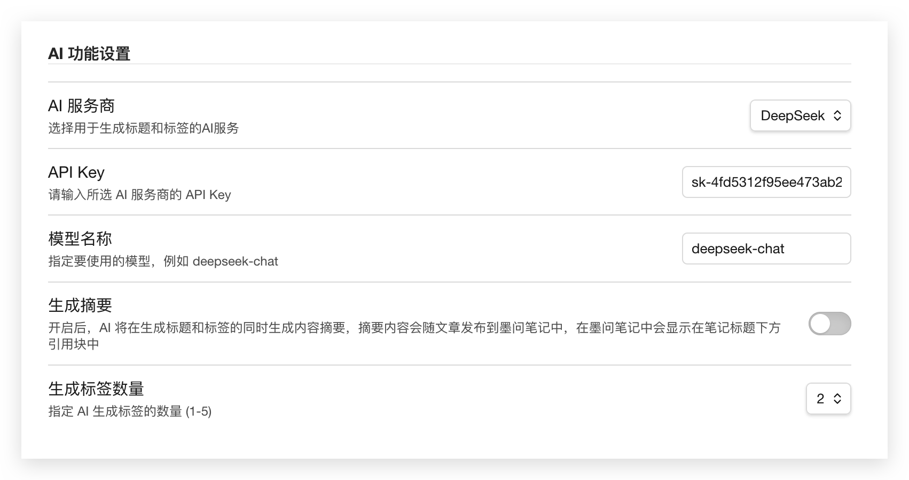
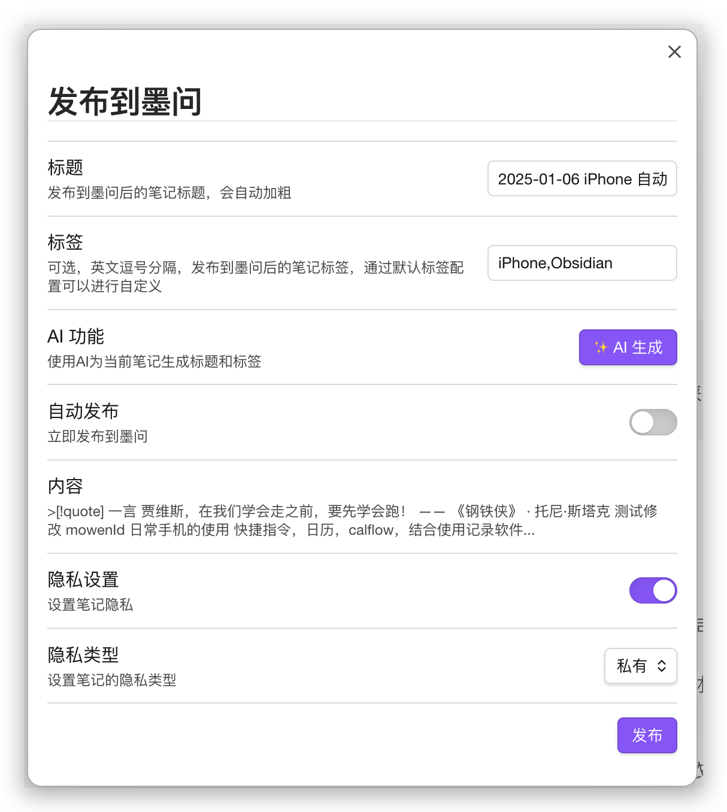

# 墨问插件

**Obsidian 墨问插件** 是一个强大的集成工具，旨在无缝连接您的 Obsidian 知识库与[墨问](https://mowen.app)笔记平台。它不仅能让您轻松地将笔记发布到墨问，还引入了由大语言模型（LLM）驱动的 AI 智能助手，大幅提升您的笔记整理与发布效率。

## 核心功能

- **一键发布**：通过右键菜单或命令面板，快速将整篇笔记或选中文本发布到墨问。
- **智能格式转换**：自动将 Markdown 格式转换为墨问支持的富文本格式，包括：
  - 标题、加粗、引用、链接
  - `![[图片.png]]` 格式的图片将被自动上传并替换为在线链接。
  - `[[内链笔记]]` 格式的笔记将被转换为墨问的内嵌笔记。
- **AI 智能助手**：
  - **智能生成元数据**：一键调用大模型（当前支持 DeepSeek），根据笔记内容自动生成**标题**、**标签**和**内容摘要**。
  - **按需生成摘要**：摘要功能可自由开关，开启后，生成的摘要将以引用块的形式自动添加到笔记标题下方。
- **高度灵活的配置**：
  - **自定义笔记ID**：自由设定 `frontmatter` 中用于存储墨问笔记ID的键名（例如 `mowenId`），避免与其他插件冲突。
  - **自定义标题**：通过在 `frontmatter` 中指定标题键，实现发布标题与文件名的解耦。
  - **智能兼容旧版ID**：提供兼容模式开关，让插件在处理存量笔记时能智能识别旧的 `noteId`，确保平滑过渡。
- **精细的发布控制**：
  - 在发布前的弹窗中，可以精细调整笔记的**标题**、**标签**、**隐私设置**（公开、私有、规则）、**分享权限**和**公开有效期**。
  - 发布成功后，插件会将墨问笔记的 ID 及相关配置自动回写到笔记的 `frontmatter` 中，方便后续管理和更新。

## 安装与配置

### 1. 安装插件
在 release 页面中下载插件，并安装到 Obsidian 中。

找到本地 Obsidian 笔记文件夹位置，在.obsidian/plugins 文件夹下创建一个名称为 obsidian-mowen-plugin 的文件夹，下载最新发布的 main.js,style.css,manifest.json 三个文件，放到刚刚创建的 obsidian-mowen-plugin 文件夹中。

### 2. 配置插件
安装并启用插件后，请前往 Obsidian 的设置页面，找到 "Mowen Plugin" 选项卡，进行以下关键配置：

#### 墨问发布设置
- **API-KEY**: **（必填）** 请输入您在墨问平台获取的 API-KEY。
- **笔记ID键名**: （推荐配置）用于在 `frontmatter` 中存储笔记 ID 的键名，默认为 `noteId`。建议修改为一个独特的名称（如 `mowenId`）以避免冲突。
- **标题属性键**: （可选）如果您希望从 `frontmatter` 中读取自定义标题，请在此处填写对应的键名（如 `mowenTitle`）。
- **兼容旧版笔记ID**: （默认开启）为了兼容存量数据，插件会默认在找不到自定义ID时回退查找 `noteId`。如果您的 `noteId` 键被其他插件占用，请关闭此项。
- **默认标签**: 您可以在此设置一个或多个默认标签（英文逗号分隔），在发布时会自动附加。
- **自动发布**: 开启后，发布到墨问的笔记将直接可见，否则将处于草稿状态。

#### AI 功能设置
- **AI 服务商**: 目前支持 `DeepSeek`。
- **API Key**: **（必填）** 请输入您所选 AI 服务商的 API Key。
- **模型名称**: 指定要使用的模型，例如 `deepseek-chat`。
- **生成摘要**: 开启后，AI 将在生成标题和标签的同时，为您提炼一段内容摘要。
- **生成标签数量**: 通过下拉菜单选择希望 AI 生成的标签数量（1-5个）。

## 使用指南

### 发布笔记
您有多种方式可以触发发布流程：
1. **右键文件**: 在文件浏览器中右键点击一篇 `.md` 笔记，选择 `Publish to Mowen`。
2. **右键选中文字**: 在编辑器中选中一段文字，右键点击，选择 `Publish Selected Text to Mowen`。
3. **使用命令面板**: 打开命令面板 (`Ctrl/Cmd + P`)，搜索并选择 `Publish to Mowen` 或 `Publish Selected Text to Mowen`。

### 发布弹窗
触发发布后，会弹出一个配置窗口，您可以在此：
- **修改标题和标签**: 插件会根据您的配置自动填充标题（文件名或`frontmatter`自定义标题）和标签，您可以在此进行修改。
- **使用AI生成**: 点击 `✨ AI 生成` 按钮，插件会根据您的AI配置和笔记内容，自动填充标题、标签，并生成摘要（如果开启）。
- **设置隐私**: 配置笔记的可见性、分享权限等。
- **预览内容**: 弹窗会展示即将发布内容的一小段预览，如果生成了摘要，摘要会以引用块的形式显示在最前方。
- **点击发布**: 完成所有配置后，点击"发布"按钮即可。

## Frontmatter 集成

插件与 `frontmatter` 深度集成，以实现持久化配置和状态管理。

### 读取的键 (Read Keys)
- `[自定义笔记ID键]`: 插件通过此键（默认为`noteId`）判断笔记是否已发布。
- `[自定义标题键]`: 插件通过此键（如`mowenTitle`）获取自定义发布标题。
- `mowenTags`, `mowenAutoPublish`, `mowenPrivacyType` 等：用于在打开已发布笔记的弹窗时，恢复上次的发布设置。

### 写入的键 (Written Keys)
发布成功后，插件会将以下信息回写到 `frontmatter` 中：
- `[自定义笔记ID键]`: 写入或更新墨问返回的笔记 ID。
- `mowenTags`: 本次发布的标签。
- `mowenAutoPublish`: 本次发布的自动发布状态。
- `mowenPrivacy...`: 本次发布的隐私设置详情。

## 许可证

本插件基于 [MIT License](LICENSE) 发布。